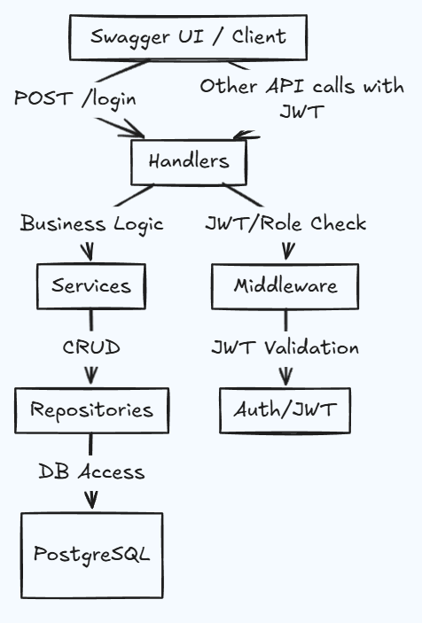

# Clinic App

A simple Golang web application for clinic management with Receptionist and Doctor portals.

## Features
- Receptionist Portal: Register & manage patients (CRUD)
- Doctor Portal: View & update patient details
- Single login with role-based access (JWT)
- API-based backend (Gin, GORM, PostgreSQL)
- Swagger API documentation
- Unit testing

## Flow



## Tech Stack
- Go (Gin framework)
- GORM ORM
- PostgreSQL
- JWT for authentication
- Swagger for API docs
- Testify for testing

## Project Structure
```
/clinic-app
│
├── cmd/
│   └── server/               # Entrypoint: main.go
│
├── internal/
│   ├── config/               # Config loading
│   ├── db/                   # PostgreSQL setup, migrations
│   ├── models/               # DB models & DTOs
│   ├── auth/                 # Auth middleware & JWT logic
│   ├── handlers/             # HTTP handlers
│   ├── services/             # Business logic
│   ├── repositories/         # DB logic (Repository pattern)
│   └── middleware/           # Auth / logger middlewares
│
├── migrations/               # SQL or Golang-based migration files
├── docs/                     # Swagger/OpenAPI or Postman collection
├── test/                     # Unit and integration tests
├── go.mod
└── README.md
```

## Getting Started
1. Clone the repo
2. Run `go mod tidy`
3. Set up PostgreSQL and configure connection in `internal/config`
4. Run migrations in `migrations/`
5. Start the server: `go run cmd/server/main.go`

---

## Documentation Link

clinic-app-doc.vercel.app

---

## License
MIT 